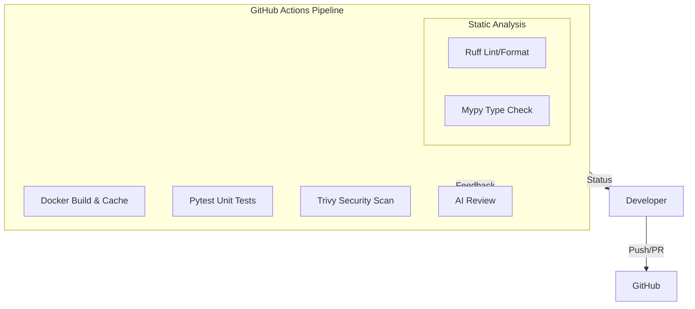
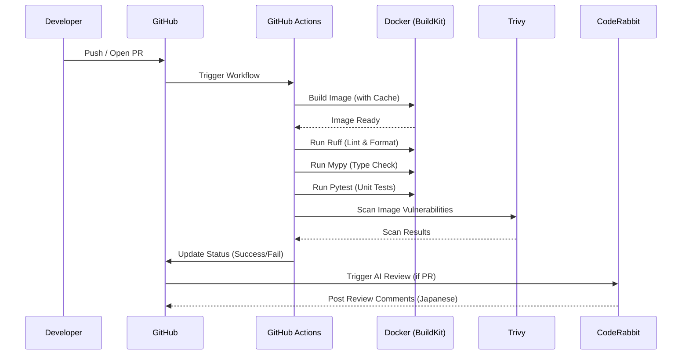

# Technical Design Document: cicd-setup

## Overview
**Purpose**: この機能は、Meeting Vibe Checker プロジェクトに強固な CI/CD パイプラインを提供し、コード品質の維持、セキュリティの確保、および開発サイクルの高速化を実現します。
**Users**: 開発者は、GitHub へのプッシュやプルリクエストを通じて、自動化されたフィードバック（Lint, Test, Security, AI Review）を受け取ります。
**Impact**: 手動による品質チェックの負担を軽減し、Docker 環境を活用することで「ローカルでは動くが CI では動かない」という問題を解消します。

### Goals
- GitHub Actions を用いた自動検証パイプラインの構築
- Docker レイヤーキャッシュの最適化による CI 実行時間の短縮
- Ruff, mypy, pytest による多角的なコード品質チェック
- Trivy によるコンテナイメージの脆弱性スキャン
- CodeRabbit による日本語での AI コードレビューの導入

### Non-Goals
- 本番環境（クラウド等）への実際のデプロイメント（本設計ではデプロイ準備までを範囲とする）
- 継続的なパフォーマンスモニタリング（APM）の導入
- フロントエンド（Streamlit）の E2E テストの完全自動化（本設計ではユニットテストに注力）

## Architecture

### Architecture Pattern & Boundary Map
CI/CD パイプラインは GitHub Actions をオーケストレーターとし、Docker を実行基盤として使用します。

### Technology Stack

| Layer | Choice / Version | Role in Feature | Notes |
|-------|------------------|-----------------|-------|
| CI/CD Platform | GitHub Actions | パイプラインの実行・管理 | |
| Runtime | Docker / Docker Buildx | 実行環境の隔離と再現性の確保 | Cache: type=gha, mode=max |
| Language | Python 3.12 | アプリケーション開発言語 | |
| Lint / Format | Ruff | 高速な静的解析とフォーマッタ | |
| Type Check | mypy | 静的型チェック | |
| Test Framework | pytest | ユニットテストの実行 | |
| Security Scan | Trivy | コンテナイメージの脆弱性スキャン | Fail on CRITICAL |
| AI Review | CodeRabbit | 自動コードレビュー | Language: ja-JP |

## System Flows

### CI Pipeline Flow

## Requirements Traceability

| Requirement | Summary | Components | Interfaces | Flows |
|-------------|---------|------------|------------|-------|
| 1.1 | Docker Buildx セットアップ | `ci.yml` | `docker/setup-buildx-action` | Build Flow |
| 1.2 | GHA キャッシュ最適化 | `ci.yml` | `cache-from/to: type=gha` | Build Flow |
| 1.3 | マルチステージ Dockerfile | `Dockerfile` | Multi-stage definition | Build Flow |
| 2.1 | Ruff による Lint | `ci.yml`, `Dockerfile` | `ruff check` | Analysis Flow |
| 2.2 | Ruff による Format | `ci.yml`, `Dockerfile` | `ruff format --check` | Analysis Flow |
| 2.3 | mypy による型チェック | `ci.yml`, `Dockerfile` | `mypy .` | Analysis Flow |
| 3.1 | pytest によるテスト | `ci.yml`, `Dockerfile` | `pytest` | Test Flow |
| 3.2 | コンテナ内での実行 | `ci.yml` | `docker run` | Flow-wide |
| 4.1 | Trivy スキャン | `ci.yml` | `aquasecurity/trivy-action` | Security Flow |
| 4.2 | CRITICAL で失敗 | `ci.yml` | `--exit-code 1 --severity CRITICAL` | Security Flow |
| 5.1 | CodeRabbit 設定 | `.coderabbit.yaml` | YAML Template | Review Flow |
| 5.2 | 日本語出力 | `.coderabbit.yaml` | `language: ja-JP` | Review Flow |

## Components and Interfaces

### [Infrastructure / CI]

#### Dockerfile (Multi-stage)
| Field | Detail |
|-------|--------|
| Intent | 再現可能な実行環境の定義とビルド最適化 |
| Requirements | 1.3, 2.1, 2.2, 2.3, 3.1 |

**Responsibilities & Constraints**
- `base`: Python 3.12-slim をベースとし、共通のライブラリ（OpenCV 等）をインストール。
- `development`: 開発用ツール（Ruff, mypy, pytest）をインストール。CI での実行主体となる。
- `production`: アプリケーションコードのみを含み、軽量でセキュアな構成とする。

#### GitHub Actions Workflow (ci.yml)
| Field | Detail |
|-------|--------|
| Intent | パイプラインの自動化とオーケストレーション |
| Requirements | 1.1, 1.2, 2.1, 2.2, 2.3, 3.1, 3.2, 4.1, 4.2 |

**Responsibilities & Constraints**
- PR 作成時および main への push 時にトリガー。
- Docker ビルドステップではキャッシュ設定（gha）を必須とする。
- すべてのチェックジョブは、ビルドされたイメージ上で `docker run` を介して実行。

#### CodeRabbit Configuration (.coderabbit.yaml)
| Field | Detail |
|-------|--------|
| Intent | AI による日本語コードレビューの設定 |
| Requirements | 5.1, 5.2 |

**Responsibilities & Constraints**
- 出力言語を `ja-JP` に固定。
- レビューの要約およびコメントの生成ルールを定義。

## Error Handling

### Error Strategy
- CI パイプラインの各ステップにおいて、非ゼロの終了コード（Exit Code != 0）が発生した場合は即座にジョブを失敗させる（Fail Fast）。
- Trivy スキャンにおいては、CRITICAL な脆弱性が発見された場合のみ終了コード 1 を返し、ビルドを停止させる。

### Monitoring
- GitHub Actions の各ステップのログにより、失敗原因（Lint エラー、テスト失敗、脆弱性検知等）を特定可能にする。

## Testing Strategy
- **Unit Tests**: `pytest` を使用し、ロジックの正当性を検証。
- **Lint Check**: `Ruff` を使用し、静的解析エラーがないことを検証。
- **Type Check**: `mypy` を使用し、型定義の不整合がないことを検証。
- **Security Check**: `Trivy` を使用し、既知の重大な脆弱性がないことを検証。

## Security Considerations
- GitHub Secrets を使用して、コンテナレジストリ等の認証情報を管理する（本フェーズではパブリックなチェックのみを想定するが、将来の拡張に備える）。
- Trivy によるイメージスキャンを全ビルドで実施し、サプライチェーン攻撃のリスクを低減する。
