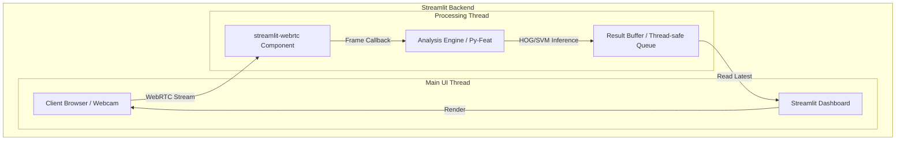
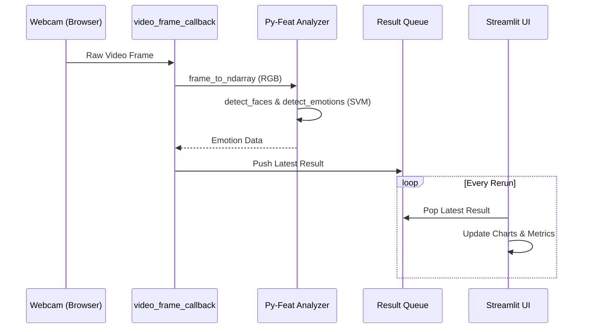

# Technical Design: Initial Setup & MVP Foundation

## Overview
この設計は、Meeting Vibe Checker (MVP) の基盤となる開発環境と、リアルタイム表情解析のパイプラインを定義します。

**Purpose**: 表情解析エンジン (Py-Feat) とダッシュボード (Streamlit) を統合し、プライバシーを保護しながら低レイテンシで感情を可視化する基盤を提供します。
**Users**: 会議のファシリテーターや参加者が、リアルタイムでミーティングの「雰囲気」を把握するために利用します。

### Goals
- Python 3.9+ による安定した開発環境の構築 (1.1, 1.2)
- リアルタイムでの表情解析パイプラインの確立 (3.2, 6.1)
- プライバシー保護を第一としたデータ処理フローの構築 (5.1, 5.2)

### Non-Goals
- 外部DBへのデータ保存
- ユーザー認証機能
- 録画・録音機能

## Architecture

### Architecture Pattern & Boundary Map
本プロジェクトは、`streamlit-webrtc` を利用した **Threaded Callback Architecture** を採用します。



### Technology Stack

| Layer | Choice / Version | Role in Feature | Notes |
|-------|------------------|-----------------|-------|
| Language | Python 3.9+ | Core logic & analysis | Type hints 必須 (2.1) |
| UI / Dashboard | Streamlit 1.30+ | Web dashboard | (2.3, 4.1) |
| Real-time Video | streamlit-webrtc | Webcam frame capture | 低レイテンシ WebRTC |
| AI / Analysis | Py-Feat | Facial Expression Analysis | SVM (HOG) モデルを使用 (3.1) |
| Image Processing | OpenCV-Python | Pre-processing | BGR/RGB conversion |
| Data | Pandas / NumPy | Result processing | 統計処理・グラフ用 (4.2) |

## System Flows

### Processing Loop Flow


## Requirements Traceability

| Requirement | Summary | Components | Interfaces | Flows |
|-------------|---------|------------|------------|-------|
| 1.1, 1.2 | 環境構築 | pyproject.toml / requirements.txt | N/A | N/A |
| 2.1-2.3 | ディレクトリ構造 | Project Scaffolding | N/A | N/A |
| 3.1, 3.2 | 解析エンジン | `SentimentAnalyzer` | `AnalyzerInterface` | Processing Loop |
| 4.1, 4.2 | UI基盤 | `DashboardUI` | Streamlit Widgets | Rerender Flow |
| 5.1, 5.2 | プライバシー | `VideoProcessor` | In-memory only | No Disk I/O |
| 6.1 | パフォーマンス | Py-Feat (SVM) | Latency checks | < 2s Loop |

## Components and Interfaces

### Analysis Layer

#### SentimentAnalyzer

| Field | Detail |
|-------|--------|
| Intent | Py-Feat をラップし、画像フレームから感情データを抽出する。 |
| Requirements | 3.1, 3.2, 5.1, 6.1 |

**Responsibilities & Constraints**
- モデルの初期化 (HOG-PCA / SVM)
- 単一フレームに対する推論
- 解析後、中間データの即時破棄 (5.2)

**Contracts**: Service [x] / State [ ]

##### Service Interface (Python Type Hints)
```python
class SentimentAnalyzer:
    def __init__(self, model_type: str = "svm"): ...
    def analyze_frame(self, frame: np.ndarray) -> Dict[str, float]:
        """
        Input: RGB Image array
        Output: Dictionary of emotion probabilities (happy, sad, etc.)
        """
```

### UI Layer

#### DashboardUI

| Field | Detail |
|-------|--------|
| Intent | 解析結果をリアルタイムにチャートとメトリクスで表示する。 |
| Requirements | 4.1, 4.2, 2.3 |

**Implementation Notes**
- `st.empty()` を使用してリアルタイム更新領域を確保。
- `st.line_chart` で感情の時系列推移を表示。

## Data Models

### EmotionResult (Data Transfer Object)
```python
{
    "timestamp": float,    # Unix timestamp
    "emotions": {
        "happy": float,    # 0.0 - 1.0
        "sad": float,
        "angry": float,
        "surprise": float,
        "neutral": float
    },
    "engagement": float    # 参加度スコア (計算ロジック後述)
}
```

## Error Handling
- **Webcam Access Error**: `streamlit-webrtc` がエラーを検知した場合、UIに警告を表示。
- **Inference Timeout**: 解析が2秒を超えた場合、フレームをスキップし警告ログを出力 (6.1)。

## Testing Strategy
- **Unit Tests**: `SentimentAnalyzer` にダミー画像を渡し、正しいフォーマットの Dict が返るか確認。
- **Performance Test**: `time.time()` を使用して推論時間を計測し、2秒以内であることを確認。
- **Privacy Test**: コードベースに `open()`, `write()`, `save()` などのファイル出力関数が含まれていないことを静的解析で確認。

---
_Design Focus: Architecture and interfaces ONLY, no implementation code_
