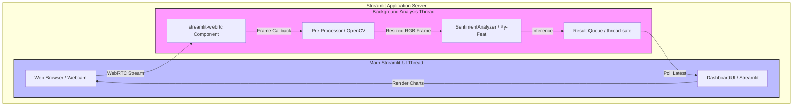
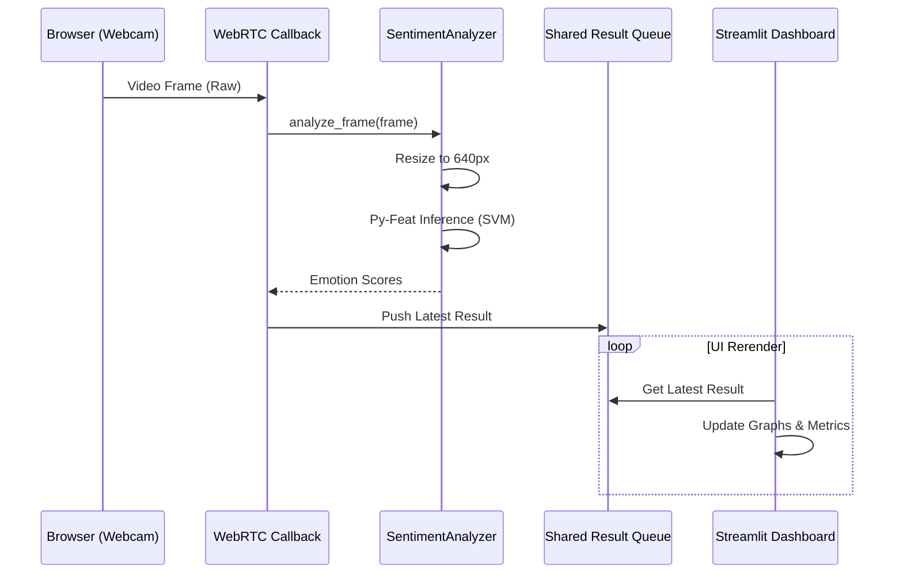

# Technical Design: Initial Setup & MVP Foundation

## Overview
この設計は、Meeting Vibe Checker (MVP) の基盤となる開発環境と、リアルタイム表情解析のパイプラインを定義します。

**Purpose**: 表情解析エンジン (Py-Feat) とダッシュボード (Streamlit) を統合し、プライバシーを保護しながら低レイテンシで感情を可視化する基盤を提供します。
**Users**: 会議のファシリテーターや参加者が、リアルタイムでミーティングの「雰囲気」を把握するために利用します。
**Impact**: プロジェクトの初期構造を確立し、将来の機能拡張（レポート生成、複数人解析など）のためのクリーンな境界を定義します。

### Goals
- Python 3.9+ による安定した、型安全な開発環境の構築 (1.1, 1.2)
- リアルタイムでの表情解析パイプライン（Webカメラ連携）の確立 (3.1, 3.2, 3.3)
- プライバシー保護を第一としたインメモリデータ処理フローの構築 (5.1, 5.2)
- 2秒以内の処理レイテンシの達成 (5.3)

### Non-Goals
- 外部データベースへのデータ保存（本フェーズでは対象外）
- ユーザー認証およびセッション管理の高度化
- 録画・録音および音声解析機能

## Architecture

### Architecture Pattern & Boundary Map
本プロジェクトは、`streamlit-webrtc` を利用した **Threaded Callback Architecture** を採用し、UIスレッドと解析スレッドを分離します。



### Technology Stack

| Layer | Choice / Version | Role in Feature | Notes |
|-------|------------------|-----------------|-------|
| Runtime | Python 3.9+ | Application logic | venvによる分離管理 (1.1) |
| UI Framework | Streamlit 1.30+ | Dashboard & UI components | (4.1, 4.2) |
| Real-time Video | streamlit-webrtc | WebRTC-based camera stream | 低レイテンシ処理用 |
| FEX Engine | Py-Feat | Facial Expression Analysis | HOG/SVM軽量モデル (3.1) |
| Computer Vision | OpenCV-Python | Frame processing & resizing | 640pxへのリサイズ実施 |
| Data Handling | Pandas / NumPy | Statistics and data structures | (4.2) |

## System Flows

### Real-time Analysis Flow


## Requirements Traceability

| Requirement | Summary | Components | Interfaces | Flows |
|-------------|---------|------------|------------|-------|
| 1.1, 1.2 | 環境構築 | `pyproject.toml`, `requirements.txt` | N/A | N/A |
| 2.1, 2.2, 2.3 | ディレクトリ構造 | `src/analysis/`, `src/ui/` | N/A | N/A |
| 3.1, 3.2, 3.3 | 解析エンジン | `SentimentAnalyzer` | `AnalyzerInterface` | Analysis Flow |
| 4.1, 4.2, 4.3 | ダッシュボード | `DashboardUI` | Streamlit Widgets | Rerender Flow |
| 5.1, 5.2 | プライバシー | `VideoProcessor` | In-memory Buffer | Analysis Flow |
| 5.3 | レイテンシ | `SentimentAnalyzer` | Performance Logs | Analysis Flow |

## Components and Interfaces

### Analysis Layer

#### SentimentAnalyzer

| Field | Detail |
|-------|--------|
| Intent | 画像フレームから表情を検出し、感情スコアを算出する責任を持つ。 |
| Requirements | 3.1, 3.3, 5.1, 5.2, 5.3 |

**Responsibilities & Constraints**
- Py-Featモデルの遅延ロードと保持 (st.cache_resource)
- 画像の事前処理（グレースケール化、リサイズ）
- 推論結果のDict形式への変換
- 解析後の中間メモリの解放 (5.2)

**Dependencies**
- External: Py-Feat — 感情解析コア (P0)
- External: OpenCV — 画像リサイズ (P1)

**Contracts**: Service [x] / State [ ]

##### Service Interface
```python
from typing import Dict, Any
import numpy as np

class SentimentAnalyzer:
    """表情解析エンジンクラス"""
    
    def __init__(self, model_type: str = "svm"):
        """モデルの初期化"""
        pass

    def analyze_frame(self, frame: np.ndarray) -> Dict[str, float]:
        """
        単一のNumPy配列（RGB）を解析し、感情確率を返す。
        Pre-condition: 期待される画像サイズは任意だが、内部で640pxに縮小される。
        Post-condition: 解析後の画像データは保持されない。
        """
        pass
```

### UI Layer

#### DashboardUI

| Field | Detail |
|-------|--------|
| Intent | ユーザーに解析結果を可視化し、Webカメラの制御を提供する。 |
| Requirements | 4.1, 4.2, 4.3 |

**Implementation Notes**
- `streamlit-webrtc` の `VideoProcessor` クラスを定義。
- 解析結果はスレッドセーフな `queue.Queue` を介して受け渡す。
- `st.empty()` プレースホルダーを使用して、再読み込みなしで数値を更新。

## Data Models

### AnalysisResult (DTO)
```python
{
    "timestamp": float,    # 解析実行時のUNIX時間
    "emotions": {
        "happy": float,    # 0.0 - 1.0
        "sad": float,
        "angry": float,
        "surprise": float,
        "fear": float,
        "disgust": float,
        "neutral": float
    },
    "metadata": {
        "processing_time": float, # 処理にかかった秒数
        "face_count": int         # 検出された顔の数
    }
}
```

## Error Handling

### Error Strategy
- **モデルロード失敗**: アプリ起動時に致命的エラーとして扱い、ユーザーに `st.error` で通知し停止する (5.4)。
- **Webカメラアクセス拒否**: ブラウザの権限不足として、UI上に「カメラを許可してください」というメッセージを表示。
- **レイテンシ超過**: 処理が2秒を超えた場合、ログを出力し、次のフレームをドロップしてキューの詰まりを解消する。

## Testing Strategy
- **Unit Tests**: `SentimentAnalyzer` に既知の表情画像（Happy/Sadなど）を渡し、期待される感情がトップスコアになるか検証。
- **Integration Tests**: `streamlit-webrtc` のモックを使用し、フレームがコールバックからキューへ正しく流れるか確認。
- **Performance Test**: 100フレーム連続処理時の平均レイテンシを計測し、2.0s以下であることを確認。
- **Privacy Compliance**: 静的解析ツール（Bandit等）および手動レビューで、ファイル保存関数が未使用であることを確認。

## Security Considerations
- **Privacy**: 画像データは不揮発性ストレージに一切書き込まない。
- **Communication**: デプロイ時はHTTPSを強制する（ブラウザのWebRTC要件）。
